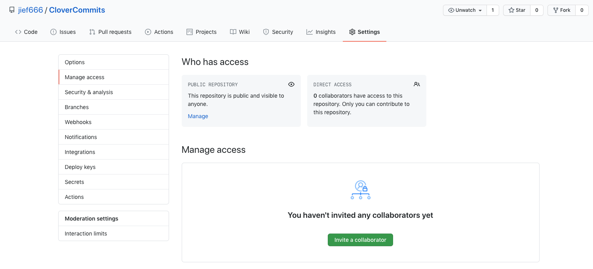

# Initial setup.

### Before :

**Make sure you have a backup solution to boot**. Another partition, a USB stick, whatever. We are setting up a shared Clover folder. I will certainly make changes that prevent it to boot at some point.  
If you locked out because you rely on this shared clover folder to boot, you'll be in trouble and I won't be able to help.

**NOTE** : Taking time to set things up correctly first saves a lot of time after. Please follow step by step. If something doesn't work as written, or is unclear, please tell me instead of continuing, trying to correct things by yourself and issuing commands without telling me.

### Setup :

* Create a github repository. Name it `"«EFI4{your name on insanelymac}»`.
* Get to repo URL in Gitbug :  
* -&gt;`cd {Bootloader partition}`
  * Remember, not the `Clover folder`.
* -&gt; `git clone {repo url} EFI`
* -&gt; `cd EFI`
* Get BootloaderChooser BootX64.efi from here : [`https://github.com/jief666/BootloaderChooser/releases`](https://github.com/jief666/BootloaderChooser/releases).
* Copy BootX64.efi in `{Bootloader partition}/EFI/BOOT`.

### If you have a working Clover :

Before you start, remember that you are setting up a shared Clover folder for tests. This Clover folder will live for the time of the test and we be specific to that test. It'll be a stripped down version of the working Clover folder.  
**Do not delete** your working Clover folder. This shared Clover folder is **not** a replacement.

* Set up your **working** Clover folder in `{Bootloader partition}/EFI/CLOVER`. Call you Clover efi file `«CloverX64.ok.efi»`.
  * Do not use the OEM folder. Because I don't have the same hardware as you, I couldn't test boot your config if you use OEM folder.
  * Delete any unused folder. Like «doc», «OEM», «ROM», in Clover folder. You can keep them in your personal Clover folder, of course.
  * In general : the less there is, the better it is.
* Check that it boots fine. On first boot, you'll get BootloaderChooser text menu. Select the efi file `«\EFI\CLOVER\CloverX64.ok.efi»`. NOTE : on next boot, you won't see the text menu again, unless you boot your computer with a key pressed down.
* -&gt; `rm {Bootloader partition}/EFI/CLOVER/misc/preboot.log`
* -&gt; `rm {Bootloader partition}/EFI/CLOVER/misc/debug.log`
* go to **Finish**.

### If you have a working OpenCore :

* Set up your **working** Clover folder in `{Bootloader partition}/EFI/OC`. Call you OpenCore efi file `«OpenCore.ok.efi»`.
* Check that it boots fine. On first boot, you'll get BootloaderChooser text menu. Select the efi file `«\EFI\CLOVER\OpenCore.ok.efi»`. NOTE : on next boot, you won't see the text menu again, unless you boot your computer with a key pressed down.
* -&gt; `rm {Bootloader partition}/opencore*.txt`
* go to **Finish**.

### Finish

* reboot.
* -&gt; `cd {Bootloader partition}/EFI`
* -&gt; `echo ".DS_Store" > .gitignore`
* -&gt; `echo "._*" >> .gitignore`
* -&gt; `echo "/CLOVER/smbios.plist" >> .gitignore`
* -&gt; `echo "Do not delete please." > "{your insanelymac name}.txt"`
* -&gt; `git add -A && git commit -m "initial commit" && git push`
* Invite me as a collaborator for your github repo. Go in "Settings" -&gt; "Manage access". See picture below. Invite `jief666` : 

* Open an issue in your repo with a brief description.
* Send me a private message on Insanelymac, just to be sure I got the notification.
* From now, regarding this issue, we'll write on Github.

**WARNING** : Do not clone the repo on your main drive, and copy efi file or other files I've sent you through the repo to your "real" Clover folder. I need to know and be sure, 100% of the time, that you boot on the exact folder we share.  
If you want to make other test on your own, rename this "EFI" folder anything you want \(like "EFI\_shared"\) and rename your personal work-in-progress to "EFI".  
Best is to have your own EFI folder and our shared EFI folder on 2 different partitions \(or USB stick\), so you don't have to rename anything.

